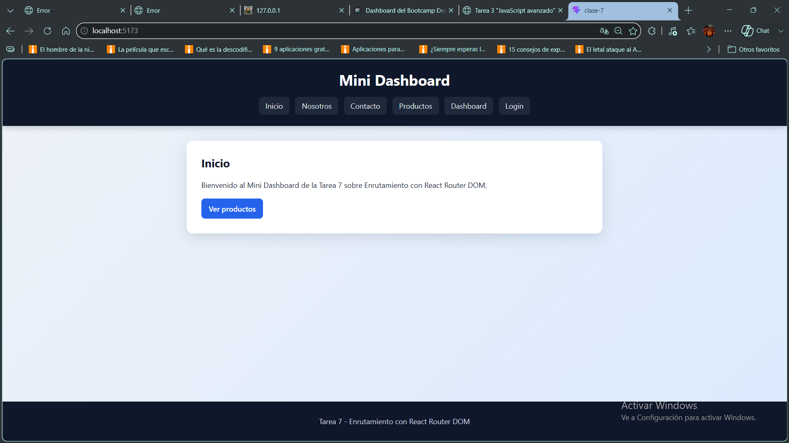
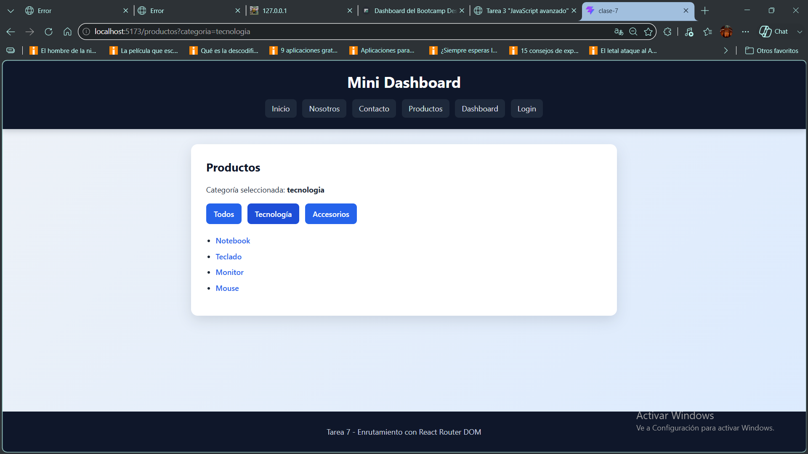
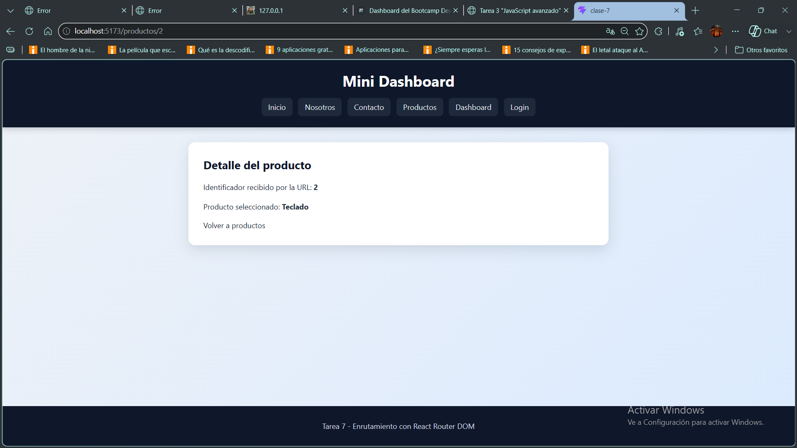
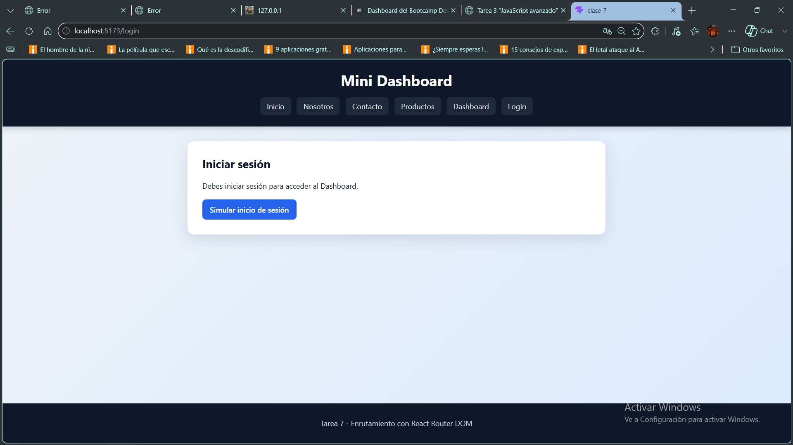
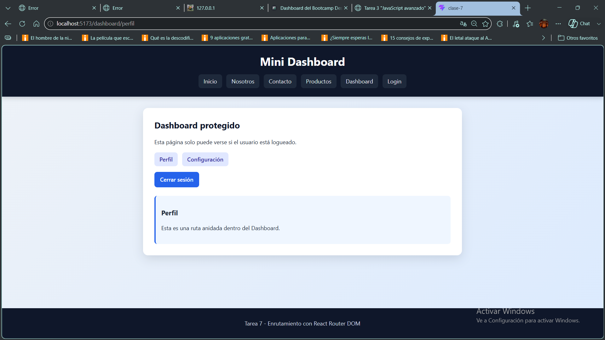

# Enrutamiento con React Router DOM

Proyecto desarrollado como práctica académica para la **Tarea del Módulo 2 - Unidad 3** de **Desarrollo en React JS**.

La aplicación implementa un sistema completo de navegación utilizando **React Router DOM**, incorporando rutas públicas, dinámicas, anidadas y protegidas. Además, utiliza navegación declarativa y programática para simular el funcionamiento de un pequeño Dashboard con autenticación.

---

# Objetivos del proyecto

Este proyecto fue desarrollado con el objetivo de aplicar y comprender el sistema de enrutamiento dentro de React, implementando una aplicación funcional que permita:

- ✅ Crear rutas públicas mediante React Router DOM.
- ✅ Implementar navegación utilizando `Link`.
- ✅ Navegar de forma programática mediante `useNavigate`.
- ✅ Utilizar rutas dinámicas mediante `useParams`.
- ✅ Leer parámetros de búsqueda utilizando `useSearchParams`.
- ✅ Implementar rutas anidadas mediante `Outlet`.
- ✅ Crear rutas protegidas utilizando `Navigate`.
- ✅ Simular autenticación mediante `localStorage`.
- ✅ Organizar la aplicación mediante componentes reutilizables.

---

# Hooks utilizados

| Hook | Función dentro del proyecto |
|------|------------------------------|
| `useNavigate` | Navegación programática entre páginas. |
| `useParams` | Obtención de parámetros dinámicos de la URL. |
| `useSearchParams` | Lectura y modificación de parámetros de búsqueda. |
| `useLocation` | Obtención de la ubicación actual para controlar el acceso a rutas protegidas. |

---

# Funcionalidades

- Navegación entre páginas mediante React Router DOM.
- Rutas públicas.
- Rutas dinámicas.
- Rutas anidadas.
- Rutas protegidas.
- Navegación declarativa mediante `Link`.
- Navegación programática mediante `useNavigate`.
- Parámetros dinámicos mediante `useParams`.
- Parámetros de búsqueda mediante `useSearchParams`.
- Página personalizada para rutas inexistentes.
- Simulación de inicio y cierre de sesión.
- Diseño responsive para computadoras, tablets y teléfonos móviles.

---

# Estructura del proyecto

- **Clase-7/**
  - **capturas/**
  - **src/**
    - **components/**
      - `BarraNavegacion.jsx`
      - `RutaProtegida.jsx`
    - **layouts/**
      - `LayoutPrincipal.jsx`
    - **pages/**
      - `Inicio.jsx`
      - `Nosotros.jsx`
      - `Contacto.jsx`
      - `Productos.jsx`
      - `Producto.jsx`
      - `Dashboard.jsx`
      - `Perfil.jsx`
      - `Configuracion.jsx`
      - `Login.jsx`
      - `NoEncontrada.jsx`
    - `App.jsx`
    - `App.css`
    - `main.jsx`
  - `package-lock.json`
  - `package.json`
  - `vite.config.js`
  - `README.md`

---

# Instalación

1. Clonar el repositorio  
   `git clone https://github.com/NDanielBarrera/Tarea-7.git`

2. Ingresar al proyecto  
   `cd Clase-7`

3. Instalar dependencias  
   `npm install`

4. Ejecutar la aplicación  
   `npm run dev`

5. Abrir  
   `http://localhost:5173/`
---

# Capturas de pantalla

## Página de inicio

---

## Navegación de productos

---

## Ruta dinámica

---

## Ruta protegida

---

## Dashboard

---

# Rutas implementadas

| Ruta | Descripción |
|------|-------------|
| `/` | Página principal |
| `/nosotros` | Información institucional |
| `/contacto` | Formulario de contacto |
| `/productos` | Listado de productos |
| `/productos/:id` | Ruta dinámica |
| `/login` | Simulación de autenticación |
| `/dashboard` | Ruta protegida |
| `/dashboard/perfil` | Ruta anidada |
| `/dashboard/configuracion` | Ruta anidada |

---

# Tecnologías utilizadas

- React 19
- React Router DOM
- Vite
- JavaScript (ES6+)
- HTML5
- CSS3

---

# Conceptos aplicados

Durante el desarrollo fueron implementados los siguientes conceptos de React Router:

- Componentes funcionales.
- React Router DOM.
- BrowserRouter.
- Routes.
- Route.
- Link.
- Navigate.
- Outlet.
- useNavigate.
- useParams.
- useLocation.
- useSearchParams.
- Rutas públicas.
- Rutas dinámicas.
- Rutas protegidas.
- Rutas anidadas.
- Navegación programática.
- Simulación de autenticación mediante localStorage.
- Diseño responsive.

---

# Autor

Nombre: Néstor Daniel Barrera

Curso: **Certificación Full Stack Web Development con React.js**

Módulo 2 - Unidad 3

Año: 2026

---

# Bibliografía

- React Documentation. https://react.dev
- React Router Documentation. https://reactrouter.com
- React Router - BrowserRouter.
- React Router - Routes.
- React Router - Route.
- React Router - Link.
- React Router - Navigate.
- React Router - useNavigate.
- React Router - useParams.
- React Router - useSearchParams.
- React Router - useLocation.
- Material de estudio UTN BA Centro de e-learning.